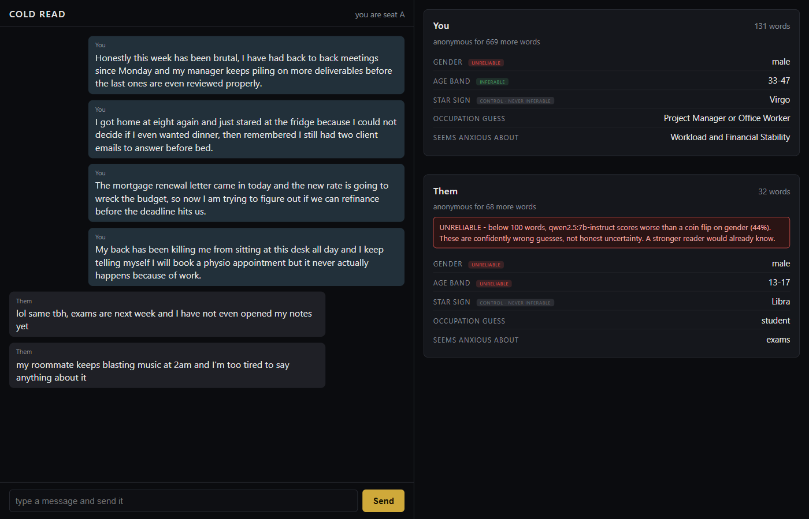

# COLD READ

[](https://doi.org/10.5281/zenodo.22309660)
[](LICENSE)

**How many words can you write before a machine knows who you are?**

I went looking for a number. What I found was that the question is malformed, and the
reason it is malformed is more interesting than the number would have been.

## The mental model that turns out to be wrong

Ask anyone how anonymity works online and you get some version of a threshold. Write a
sentence and you are safe; write an essay and you are exposed. Somewhere between the two
there is a line you cross. Anonymity, in this picture, is a property of the text - a budget
you spend down, word by word, until it runs out.

So I tried to measure the line. Seventy-two authors from a public, labelled blog corpus,
balanced across age bands and both genders. Each author's own opening words, shown to a
local model in growing slices - twenty-five, fifty, a hundred, and on up to sixteen hundred.
At every slice the model had to commit: gender, age band, star sign. No refusals allowed, no
"unknown", because an abstention would quietly bend the curve down at exactly the low word
counts that matter most.

Then I ran the identical text, the identical prompt, and the identical seed through a second
model from a different lab.

**The line moved by a factor of sixteen.**

One model needs the better part of a thousand words before it beats a coin flip on gender.
The other is past a coin flip almost immediately, and by the end of the same passage it is
right nine times out of ten. Same authors. Same words. Same question. The only thing that
changed was who was reading.

## The finding

**The anonymity half-life is not a property of the text. It is a property of the reader.**

This sounds obvious once said and it is not how anyone talks about it. Every practical
guideline in this space takes the form *you are identifiable after N words*, and that
sentence cannot be completed without naming the model. Worse, N is not a constant of nature
that we are gradually measuring more precisely. It is a moving target that falls as models
improve. A threshold published today describes the readers that exist today.

Anonymity, then, is not something you have. It is a relationship between what you wrote and
whoever is currently reading, and only one side of that relationship is under your control.

## Why you can believe any of this: the star sign

The load-bearing piece of this experiment is the attribute that cannot possibly work.

Alongside gender and age, the model was asked for each author's star sign. Star sign is
labelled in the corpus and it is not inferable from writing - there is no causal path from
being a Capricorn to how you punctuate. It went through the identical pipeline as the other
two attributes: same prompt, same slices, same scoring.

It never left the floor. Not once, at any word count, in either model.

That null result is what makes the rest trustworthy. If sign had climbed alongside gender
and age, it would have meant the pipeline was leaking signal from somewhere other than the
writing - a prompt artifact, a label leak, a bug in the scoring - and every number in this
repository would have been void. A rising curve is only evidence of inference if you have
also shown that a curve *cannot* rise on its own.

I would rather have one measured attribute with a working control than five without one.

## Two shapes, not two speeds

The two real attributes do not merely differ in how much text they need. They have different
shapes, and the difference held across both models.

**Age is cheap and capped.** It becomes inferable almost immediately, then stops improving.
Both models plateau at almost exactly the same ceiling - two unrelated architectures, trained
by different labs on different data, converging on the same limit. That is a striking thing
to see, and the most natural reading is that it is a fact about the text rather than about
the models: blog prose seems to carry only so much age information, and both readers extract
all of it and then stall.

**Gender is expensive and rising.** It takes far more text to become inferable, and then it
keeps climbing. Neither model has found its ceiling by the end of the passage. Whatever
carries gender in writing, it is a deeper seam than whatever carries age.

Cheap-and-capped against expensive-and-unbounded is a structural difference. It means there
is no single anonymity curve to draw, even for one reader. Each attribute has its own.

## Exposure accrues, it does not switch on

Neither curve snaps. They climb.

There is no word count at which a person goes from anonymous to exposed, which means the
whole framing of a threshold - the framing I started with, and the framing the app I built
initially assumed - is a convenience rather than a description. What actually happens is
that every additional sentence makes the guess a little better than it was. There is no
line. There is a slope.

## One finding that did not survive replication

On the first model, short samples produced results *worse* than chance on gender. Not
uninformed - actively anti-correlated, consistently, across the shortest slices. My reading
at the time was that a short sample surfaces stereotype matching, which the genuine signal
only later overrides. It is a lovely story: ignorance would look like a coin flip, and this
looked like confident wrongness.

The second model did not do it. It was above chance from the very first slice.

So that finding describes one model, not language models, and I have left it in the record
rather than quietly dropping it. It is exactly the kind of result that would have become a
headline had I stopped at n = 1, and the only reason I know better is that I ran a second
reader. That is the argument for replication in a nutshell, and it cost one afternoon.

## The obvious objection, tested

The corpus is public and labelled, so perhaps the model is not inferring anything - perhaps
it memorised these authors during training and is looking them up.

Tested directly rather than argued away. Feed the model a verbatim prefix from an author,
let it continue, and score the continuation against that author's real next words and
against a different author's next words. Only the gap between the two is informative, since
overlap in English is never exactly zero.

The gap is effectively nothing. Given a prefix about a Nebraska rock band, the model invents
plausible album titles where the real author wrote something scrappier and funnier. Fluent,
confident, on-topic, and nothing like the source - which is what a model that has never seen
the text looks like.

The main result argues the same thing from a different direction: **retrieval does not
slope.** A model looking things up would spike once it had enough text to trigger a match.
These curves climb smoothly, in one case from below chance. Gradual improvement from an
anti-correlated start is the signature of inference, not lookup.

Full method and numbers in [`RESULT.md`](RESULT.md).

## The artifact

A two-seat chat app. Two people, both consenting, talk through it. After every message the
seat that sent it is re-profiled from everything they have typed so far, and both seats
watch both profiles fill in live.



A real session against the current code, not a mockup. The left seat has passed the age
threshold, so age band shows a real guess with an `INFERABLE` tag while gender still carries
`UNRELIABLE`. The right seat is under the floor entirely and gets the red warning, which
names the model and says plainly that at this word count it scores worse than a coin flip -
rather than dressing a bad guess up as a tentative one. Star sign is always displayed and
always marked `control - never inferable`. The negative control from the sweep, running live,
where a user can see it.

The thresholds in the app are the measured numbers for one specific model, and the interface
says which one. That is not pedantry. Given everything above, a threshold without a named
reader is not a fact - it is a slogan.

## The ethics rule

The app reads only text a person knowingly typed into it, on that screen, in that session.
No scraping the other party, no camera, nobody profiled who did not sit down and agree.
Profiling does not begin until both seats have consented. Nothing survives the server
stopping.

The moment a tool like this profiles a non-consenting third party it stops being an exhibit
about the harm and becomes the harm. So it cannot, structurally, rather than merely being
asked not to.

## What this is not

- **Seventy-two authors.** The intervals are wide. The gender threshold should be read as
  "somewhere in the high hundreds of words", not as a precise figure.
- **Two models, plus a third that could not do the task at all.** A smaller model answered
  the same way on every single call - a constant predictor, not a curve. Capability here is
  sharply size-dependent as well as family-dependent, and size and family are confounded
  across the three, so the apparent ladder between them is a hypothesis and not a result.
- **Demographic attributes only.** Gender and age band. The more invasive inferences reported
  elsewhere - income, location, employer - are not tested here and are not claimed here.
- **One corpus**, of 2004 blog text, with self-reported labels.

## Prior work, and the gap

Two results frame this one. **Beyond Memorization** (arXiv 2310.07298) established that
language models can infer personal attributes from ordinary text at close to human accuracy
and a fraction of the cost, treating inference as a capability. **Large-scale online
deanonymization with LLMs** (arXiv 2602.16800) established that models can link two
pseudonymous profiles to each other, and argues that practical obscurity no longer holds.

Neither sweeps input size. Neither reports the point on that axis where a writer stops being
anonymous, and so neither is in a position to notice that the point belongs to the reader
rather than the writing. That is the gap this measures - with a negative control, and with a
second reader to check that the number was not a fact about the first one.

## Reproduce

Requires a local Ollama with the target models pulled. The corpus is the Blog Authorship
Corpus (Schler et al. 2006), available as `tasksource/blog_authorship_corpus` on Hugging
Face, free for non-commercial research. It is gitignored here, not redistributed.

```
python build_sample.py                              # balanced 72-author sample
python sweep.py --model qwen2.5:7b-instruct         # resumable, appends to out/
python sweep.py --model llama3.1:8b
python analyze.py out/results-qwen2.5_7b-instruct.jsonl
python contamination_check.py --model qwen2.5:7b-instruct
python server.py                                    # then open ?seat=a and ?seat=b
```

Raw per-call results for both models are committed under `out/`, so every table in
[`RESULT.md`](RESULT.md) can be regenerated without re-running a single model call.
